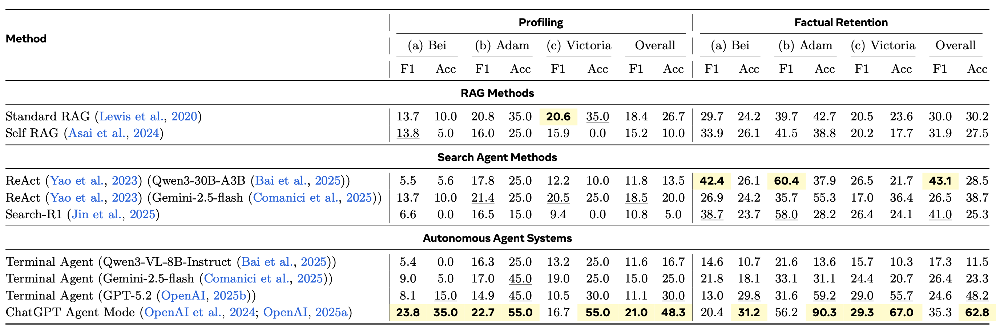
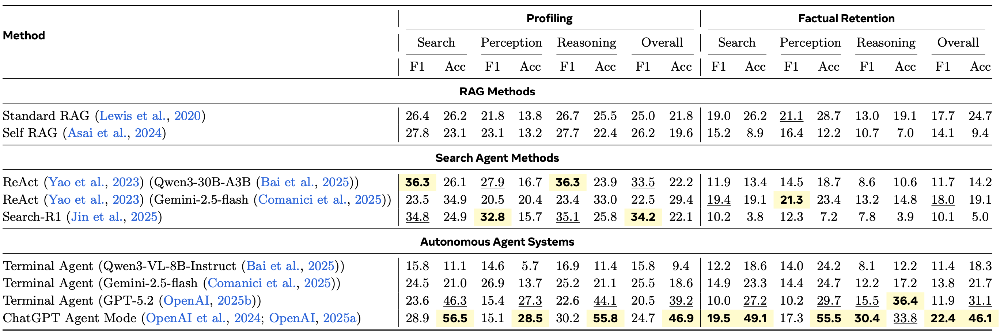

# HippoCamp: Benchmarking Contextual Agents on Personal Computers

HippoCamp is a benchmark for evaluating contextual agents on realistic personal-computing environments. It covers multimodal file management across documents, images, audio, video, emails, calendars, and other everyday artifacts, with 42.4 GB of data across more than 2K files. On top of these environments, HippoCamp provides 581 QA pairs and 46.1K structured trajectory annotations for analyzing search, perception, and multi-step reasoning failures.

[](https://savannah-yz.github.io/project_page/HippoCamp/)
[](https://savannah-yz.github.io/data_visualization/HippoCamp/)
[](https://huggingface.co/datasets/MMMem-org/HippoCamp)
[](docs/paper/HippoCamp.pdf)
[](https://savannah-yz.github.io/project_page/HippoCamp/)
[](#video)
[](#docker-images)


## Release Status

- HippoCamp was submitted to ECCV on February 15, 2026.
- Public release dates for the repository, project page, dataset, and visualization assets will be finalized later.
- The demo video link, Docker archive download links, and final citation are not finalized yet.

## Overview

HippoCamp instantiates three archetypal personal-computing environments and evaluates two task families:

- **Factual Retention**: retrieve, comprehend, and reason over factual information grounded in multimodal files.
- **Profiling**: aggregate weak, distributed evidence across files and time to infer a coherent user model.

The current release includes:

- **42.4 GB** of benchmark data
- **2K+** real-world files
- **581** QA pairs
- **46.1K** structured trajectory annotations
- **3** user profiles
- **2** task families

The released annotation JSONs follow the hierarchy below.


## Release Assets

| Asset | Status | Location | Contents |
| --- | --- | --- | --- |
| GitHub repository | Available | this repository | code, configs, docs, figures, evaluation scripts, sample assets |
| Hugging Face dataset | Available | <https://huggingface.co/datasets/MMMem-org/HippoCamp> | raw environments, official annotation JSONs, `HippoCamp_Gold`, metadata spreadsheets |
| Project page | Available | <https://savannah-yz.github.io/project_page/HippoCamp/> | benchmark overview, examples, leaderboard |
| Data visualization | Available | <https://savannah-yz.github.io/data_visualization/HippoCamp/> | interactive environment visualization |
| Docker archives | Pending | to be added at release | six prebuilt benchmark images |
| Demo video | Pending | to be added at release | end-to-end WebUI and agent demo |
| Citation | Pending | to be finalized after release | final BibTeX and `CITATION.cff` |

## Data Layout

The Hugging Face dataset is the authoritative data release. Its main structure is:

```text
HippoCamp/
├── Adam/
│   ├── Subset/
│   │   ├── Adam_Subset/
│   │   ├── Adam_Subset.json
│   │   └── Adam_Subset.xlsx
│   └── Fullset/
│       ├── Adam/
│       ├── Adam.json
│       └── Adam_files.xlsx
├── Bei/
│   ├── Subset/
│   │   ├── Bei_Subset/
│   │   ├── Bei_Subset.json
│   │   └── Bei_Subset.xlsx
│   └── Fullset/
│       ├── Bei/
│       ├── Bei.json
│       └── Bei_files.xlsx
└── Victoria/
    ├── Subset/
    │   ├── Victoria_Subset/
    │   ├── Victoria_Subset.json
    │   └── Victoria_Subset.xlsx
    └── Fullset/
        ├── Victoria/
        ├── Victoria.json
        └── Victoria_files.xlsx
```

These artifacts serve different roles:

- The six source directories store the raw personal-computing files.
- The six annotation JSON files store released QA pairs together with annotations such as `file_path`, `file_number`, `file_modality`, `file_type`, `evidence`, `rationale`, `agent_cap`, `QA_type`, and `profiling_type`.
- `HippoCamp_Gold` stores parsed-text JSON files with the schema `{file_info, summary, segments}`.
- The `*_files.xlsx` spreadsheets store explicit metadata such as creation time, modification time, and location fields.

The Hugging Face Dataset Viewer exposes six configs, each with `profiling` and `factual_retention` splits:

| Config | Profile | Scope | Raw files | Total QA | Profiling | Factual retention |
| --- | --- | ---: | ---: | ---: | ---: | ---: |
| `adam_fullset` | Adam | Full | 344 | 123 | 20 | 103 |
| `adam_subset` | Adam | Subset | 158 | 18 | 6 | 12 |
| `bei_fullset` | Bei | Full | 875 | 235 | 20 | 215 |
| `bei_subset` | Bei | Subset | 147 | 27 | 4 | 23 |
| `victoria_fullset` | Victoria | Full | 711 | 223 | 20 | 203 |
| `victoria_subset` | Victoria | Subset | 137 | 11 | 6 | 5 |

## What To Download And Why

All public benchmark data is distributed from the Hugging Face dataset page:

- <https://huggingface.co/datasets/MMMem-org/HippoCamp>

On that page, open the `Files and versions` tab to browse and download the released directories and files.

| If you want to... | Download this | Why it is needed | Local destination |
| --- | --- | --- | --- |
| run the RAG / search-agent pipeline | `HippoCamp_Gold/` | it stores the parsed-text JSON used for indexing and retrieval | `benchmark/HippoCamp_Gold/` |
| run terminal-agent batch evaluation | one official annotation JSON such as `Adam.json` or `Adam_Subset.json` | it provides the released questions, answers, and evidence annotations used as `--questions-file` | any local path |
| reproduce the analysis figures | `Adam.json`, `Bei.json`, `Victoria.json`, `Adam_files.xlsx`, `Bei_files.xlsx`, `Victoria_files.xlsx` | the analysis scripts read the fullset annotations and metadata spreadsheets directly | `benchmark/analysis/data/` |
| inspect or study the raw benchmark environments | the six source directories under `Adam/`, `Bei/`, and `Victoria/` | they contain the original personal-computing files | any local path |

`HippoCamp_Gold` is not just an optional extra. It is the parsed-text release that powers the public RAG workflow and the Docker-side `return_txt` interface. If you only want to browse the raw files in Docker, you do not need it locally. If you want to run the released retrieval pipeline, you do.

## Repository Structure

```text
.
├── README.md
├── .env.example
├── requirements.txt
├── evaluate.py
├── CITATION.cff
├── assets/
│   ├── figs/
│   └── tables/
├── docs/
│   ├── docker_api.md
│   ├── evaluation.md
│   ├── reproduction.md
│   └── paper/HippoCamp.pdf
├── benchmark/
│   ├── README.md
│   ├── pyproject.toml
│   ├── sample_questions.json
│   ├── configs/
│   │   ├── evaluation.yaml
│   │   ├── providers.yaml
│   │   ├── retriever_server.yaml
│   │   ├── services.yaml.example
│   │   └── pipelines/
│   ├── scripts/
│   │   ├── run_offline.py
│   │   ├── run_query.py
│   │   ├── run_evaluation.py
│   │   └── retriever_server.py
│   ├── src/
│   │   ├── providers/
│   │   │   ├── generator/
│   │   │   └── retrieval/
│   │   ├── rag/
│   │   └── shared/
│   ├── analysis/
│   │   ├── README.md
│   │   └── data/README.md
│   └── HippoCamp_Gold/README.md
└── agent/
    ├── README.md
    ├── gemini.py
    ├── chatgpt.py
    ├── claude.py
    ├── vllm.py
    ├── gemini_batch.py
    ├── chatgpt_batch.py
    ├── claude_batch.py
    ├── vllm_batch.py
    └── prompt_modules/
        ├── config.py
        └── prompt_body.py
```

## Install

### 1. Clone the repository and create an environment

```bash
git clone https://github.com/Savannah-yz/HippoCamp.git
cd HippoCamp

python3 -m venv .venv
source .venv/bin/activate
pip install --upgrade pip
pip install -r requirements.txt
```

Optional editable install for the benchmark subsystem:

```bash
pip install -e ./benchmark --no-deps
```

`requirements.txt` already includes the merged dependency set used by the public release.

### 2. Configure local caches

```bash
export XDG_CACHE_HOME=$PWD/.cache
export MPLCONFIGDIR=$PWD/.cache/matplotlib
```

### 3. Create `.env`

```bash
cp .env.example .env
```

The root `.env` covers terminal-agent keys, RAG provider keys, judge settings, and optional local-service configuration.

### 4. Download benchmark data

Use the Hugging Face dataset pieces as follows:

- **RAG / search-agent pipeline**: place the parsed-text release under `benchmark/HippoCamp_Gold/`.
- **Terminal-agent batch evaluation**: use an official annotation JSON such as `Adam.json`, `Adam_Subset.json`, `Bei.json`, or `Victoria_Subset.json` as `--questions-file`.
- **Analysis reproduction**: place the three fullset annotation JSON files and the three fullset metadata spreadsheets under `benchmark/analysis/data/`.

Concrete analysis-input placement:

```bash
mkdir -p benchmark/analysis/data

cp /path/to/HippoCamp/Adam/Fullset/Adam.json benchmark/analysis/data/Adam.json
cp /path/to/HippoCamp/Bei/Fullset/Bei.json benchmark/analysis/data/Bei.json
cp /path/to/HippoCamp/Victoria/Fullset/Victoria.json benchmark/analysis/data/Victoria.json

cp /path/to/HippoCamp/Adam/Fullset/Adam_files.xlsx benchmark/analysis/data/Adam_files.xlsx
cp /path/to/HippoCamp/Bei/Fullset/Bei_files.xlsx benchmark/analysis/data/Bei_files.xlsx
cp /path/to/HippoCamp/Victoria/Fullset/Victoria_files.xlsx benchmark/analysis/data/Victoria_files.xlsx
```

If you are unsure which Hugging Face asset corresponds to your workflow, use the `What To Download And Why` table above first.

### 5. Install Docker Desktop

- macOS / Windows: <https://www.docker.com/products/docker-desktop/>
- Linux: follow your distribution-specific Docker Engine setup

## Docker Images

The public workflow uses six prebuilt Docker archives. Their download links are not finalized yet, but the expected archive names, image names, and host-port mappings are fixed:

| Archive | Image | Container name | Host port | Download |
| --- | --- | --- | --- | --- |
| `hippocamp_bei_subset.tar` | `hippocamp/bei_subset:latest` | `hippocamp-bei-subset` | `18081` | To be added at release |
| `hippocamp_adam_subset.tar` | `hippocamp/adam_subset:latest` | `hippocamp-adam-subset` | `18082` | To be added at release |
| `hippocamp_victoria_subset.tar` | `hippocamp/victoria_subset:latest` | `hippocamp-victoria-subset` | `18083` | To be added at release |
| `hippocamp_bei_fullset.tar` | `hippocamp/bei_fullset:latest` | `hippocamp-bei-fullset` | `18084` | To be added at release |
| `hippocamp_adam_fullset.tar` | `hippocamp/adam_fullset:latest` | `hippocamp-adam-fullset` | `18085` | To be added at release |
| `hippocamp_victoria_fullset.tar` | `hippocamp/victoria_fullset:latest` | `hippocamp-victoria-fullset` | `18086` | To be added at release |

Load an archive once you have it:

```bash
docker load -i hippocamp_adam_subset.tar
```

Start a container:

```bash
docker run -it -p 18082:8080 --name hippocamp-adam-subset hippocamp/adam_subset:latest
```

The `docker run -it ...` command gives you the interactive shell. Start the browser WebUI inside the container with:

```bash
webui
```

For detailed container, WebUI, and HTTP-route behavior, see [`docs/docker_api.md`](docs/docker_api.md).

## Inputs and Outputs

The main workflows use different inputs and produce different artifacts:

| Workflow | Main inputs | Required external assets | Main outputs |
| --- | --- | --- | --- |
| RAG / search-agent pipeline | `benchmark/sample_questions.json` for smoke tests, or an official annotation JSON via `--batch` | `benchmark/HippoCamp_Gold/` | per-query result JSONs in `--output-dir`, plus `summary_*.json` and `evaluation_*.json` |
| Terminal agent, single question | a Docker container plus `--question` | Docker image archive | one session log JSON via `--log-json` |
| Terminal agent, batch | `--questions-file` pointing to an official annotation JSON | Docker image archive | `summary.jsonl`, per-question result JSON files, `aggregate.json`, and stdout/stderr logs |
| Top-level evaluator | JSON or JSONL file via `evaluate.py --input-dataset` | none | per-query judge results JSON and aggregate metrics JSON |
| Analysis scripts | fullset annotation JSON files and `*_files.xlsx` spreadsheets | Hugging Face fullset assets | figures and reports under `benchmark/analysis/outputs/` |

If you are unsure which files to feed into which script, start with [`docs/reproduction.md`](docs/reproduction.md), [`benchmark/README.md`](benchmark/README.md), and [`agent/README.md`](agent/README.md).

## Reproduction Paths

HippoCamp exposes two complementary evaluation paths:

- a **RAG / search-agent** pipeline under `benchmark/`
- a **terminal-agent** pipeline under `agent/`

For complete step-by-step commands covering all methods and configurations, see [`docs/reproduction.md`](docs/reproduction.md).

### A. RAG / Search-Agent Pipeline

Run these commands from `benchmark/`.

1. Copy the parsed-text release into `benchmark/HippoCamp_Gold/`.
2. Copy and configure the service config and environment file:
   ```bash
   cp configs/services.yaml.example configs/services.yaml
   cp ../.env.example ../.env
   ```
3. Start Qdrant if you use the default local vector-store setup.
4. Build the local index.
5. Run a baseline.

```bash
docker run -p 6333:6333 -p 6334:6334 \
  -v "$PWD/data/qdrant_storage:/qdrant/storage" \
  qdrant/qdrant

python3 scripts/run_offline.py HippoCamp_Gold/ --all -e hippo

python3 scripts/run_query.py --batch sample_questions.json -e hippo \
  --retrieval standard_rag --generator gemini --evaluate
```

Use `sample_questions.json` only for smoke tests. For full evaluation, replace it with one of the official Hugging Face annotation JSON files.

### B. Terminal-Agent Pipeline

Run the terminal-agent commands from the repository root.

Single-question example:

```bash
python3 agent/chatgpt.py \
  --container hippocamp-adam-subset \
  --question "What does the guide say about court dress code?" \
  --ensure-webui \
  --log-json result/chatgpt_docker_session.json
```

Batch example:

```bash
python3 agent/chatgpt_batch.py \
  --container hippocamp-adam-subset \
  --questions-file /path/to/Adam_Subset.json \
  --ensure-webui \
  --log-dir log/chatgpt_batch \
  --result-dir result/chatgpt_batch
```

The canonical batch input is an official annotation JSON from Hugging Face, not `HippoCamp_Gold`.

#### Prompt Configs For Docker-Based Agent Evaluation

The terminal-agent wrappers expose `--prompt-config` so you can control whether the agent may use:

| Config | `return_ori` | `return_txt` | `return_img` | Recommended use |
| --- | --- | --- | --- | --- |
| `config0` | on | on | on | Full auxiliary interface |
| `config1` | on | off | off | Source-only setting |
| `config2` | on | off | on | Image-enabled, text-disabled |
| `config3` | on | on | off | Text-enabled, image-disabled |

### C. Prompt-Based Agent Output Evaluation

For terminal-agent outputs and other custom agent results, use `evaluate.py`:

```bash
python3 evaluate.py \
  --input-dataset result/chatgpt_batch/aggregate.json \
  --per-query-results-json result/chatgpt_batch/judge_results.json \
  --aggregate-metrics-json result/chatgpt_batch/judge_summary.json
```

## Evaluation

HippoCamp exposes two distinct evaluation entrypoints for different output formats.

| Entrypoint | Intended for | Metrics |
| --- | --- | --- |
| `benchmark/scripts/run_evaluation.py` | RAG / search-agent outputs from `run_query.py` | ROUGE, BLEU, exact match, semantic similarity, BERTScore, retrieval P/R/F1, LLM judge |
| `evaluate.py` | Terminal-agent and custom agent outputs | LLM-as-a-judge answer quality, file-list P/R/F1 |

For detailed input/output schemas, JSON examples, and command options, see [`docs/evaluation.md`](docs/evaluation.md).

## Develop Your Prompt-Based Agent

The `agent/` directory is designed to be extensible. The released wrappers use a tag-based interaction contract centered on `<tool>` and `<answer>`:

```text
<think>...</think>
<tool>{"name":"terminal","arguments":{"command":"..."}}</tool>
<answer>...</answer>
```

To build your own prompt-based agent:

- Start from `agent/gemini.py` or `agent/vllm.py`.
- Keep the same terminal-tool contract and JSON command shape.
- Treat `/hippocamp/data` as the working directory root for benchmark file paths.
- Use the released Docker commands as the environment interface: `list_files`, `return_txt`, `return_img`, `return_ori`, `return_metadata`, `set_flags`, `webui`, `webui_status`, and `webui_stop`.
- Preserve the batch output schema so that `evaluate.py` can score your results without extra adapters.

## Results and Analysis

### Table 1



**Main results on HippoCamp across user profiles.** We evaluate representative MLLMs and agent methods on profiling and factual retention, reporting F1 and accuracy (Acc) for each profile and the overall average.

### Table 2



**Agent capability-wise analysis on HippoCamp.** We report F1 and LLM-judge accuracy aggregated by capability labels, decomposed into search, perception, and reasoning.

### Analysis Figures

#### Number of Supporting Files Per Question


This figure shows how many ground-truth supporting files each question requires. It is the benchmark's direct view of evidence breadth.

#### Number of Evidence Modalities Per Question


This figure shows how many distinct file modalities each question spans, such as documents, images, audio, or other file types.

#### Annotated Reasoning Depth Per Question


This figure shows the number of reasoning steps required by the released rationale annotations.

#### Overall Difficulty Distribution


This figure summarizes the released scalar difficulty score, which combines evidence breadth, modality breadth, file types, evidence items, reasoning steps, question length, answer length, and time span.

#### Performance As Question Difficulty Increases


This figure aligns question difficulty with per-question judge scores across released methods, showing how performance changes as questions become harder.

See [`benchmark/analysis/README.md`](benchmark/analysis/README.md) for the scripts that reproduce these figures.

## Leaderboard and Result Submission

The public leaderboard is hosted on the project page:

- <https://savannah-yz.github.io/project_page/HippoCamp/>

If you evaluate a new prompt-based agent or baseline, email your result package to `zhe012@e.ntu.edu.sg`. Include the method name, model name, settings summary, and either the result JSON or the aggregate evaluation output.

## Video

The demo video link will be added after the release assets are finalized.

## Citation

The final citation will be added after the public release is finalized. The current `CITATION.cff` file should be treated as provisional until then.
