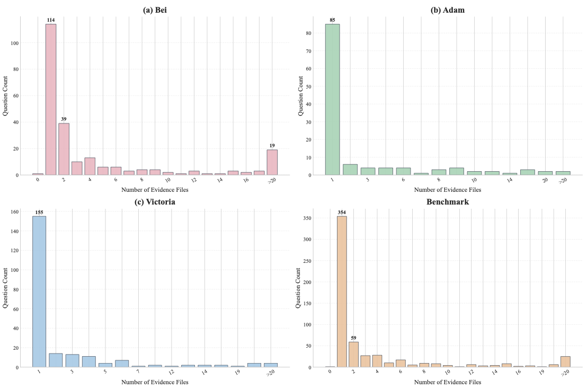
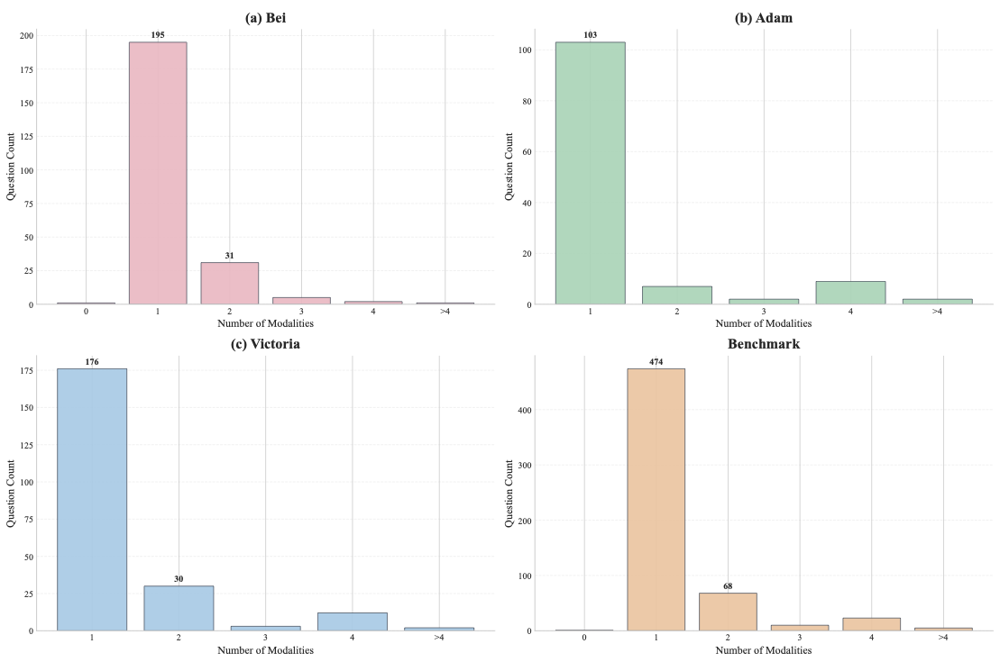
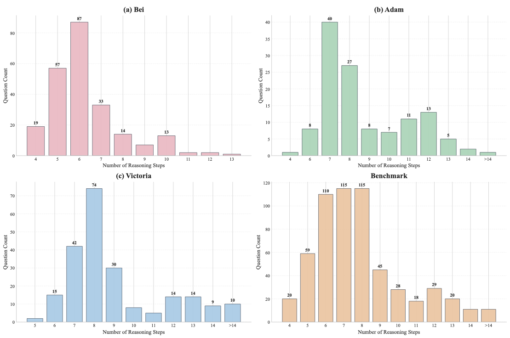
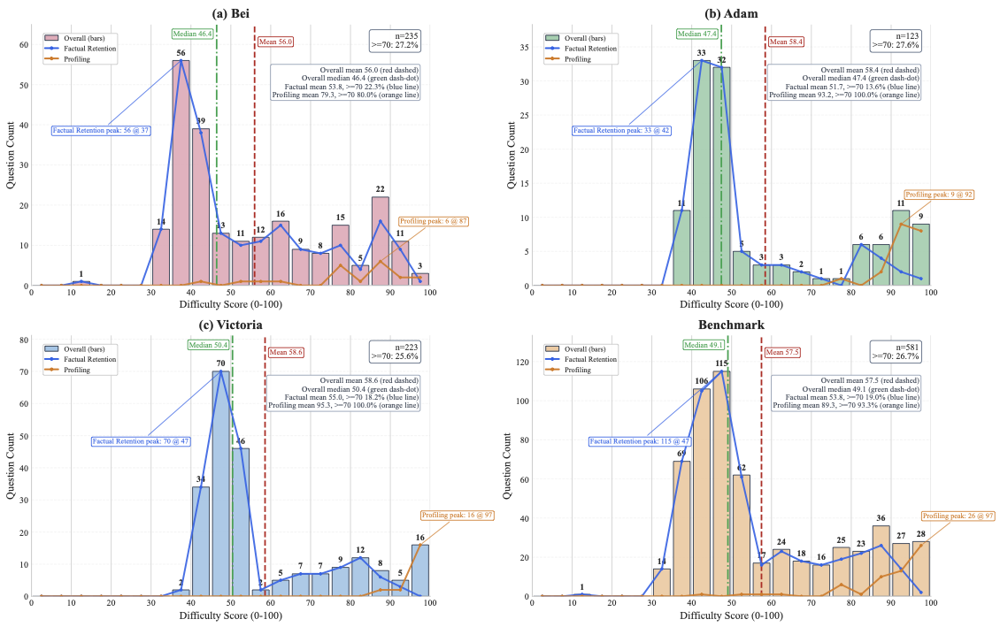
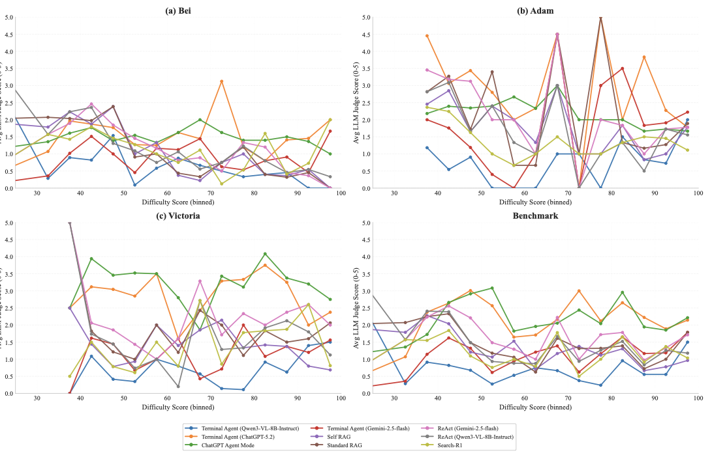

# HippoCamp: Benchmarking Contextual Agents on Personal Computers

We present HippoCamp, a benchmark designed to evaluate agents on multimodal file management in realistic, user-centric environments. HippoCamp instantiates device-scale file systems over three real-world profiles, spanning documents, images, audio, video, emails, calendars, and other everyday digital artifacts, with 42.4 GB of data across more than 2K files. Building on these environments, we construct 581 QA pairs to evaluate search, evidence perception, and multi-step reasoning, and release 46.1K densely annotated structured trajectories for fine-grained failure diagnosis. Our experiments show that even the strongest current models still struggle with long-horizon retrieval, cross-modal reasoning, and evidence grounding in dense personal file systems.

[](https://savannah-yz.github.io/project_page/HippoCamp/)
[](https://savannah-yz.github.io/data_visualization/HippoCamp/)
[](https://huggingface.co/datasets/MMMem-org/HippoCamp)
[](docs/paper/HippoCamp.pdf)
[](https://savannah-yz.github.io/project_page/HippoCamp/)
[](XXXXXXX)
[](XXXXXXX)
[](#install)


## News

- `[02/15/2026]`: Submitted to ECCV.
- `[03/26/2026]`: GitHub repository released.
- `[03/26/2026]`: Project page, data visualization, and Hugging Face dataset released.

## Overview

HippoCamp instantiates three archetypal personal-computing environments and evaluates 2 task families (Profiling & Factual Retention):

- **Factual Retention**: evaluates an agent's capability to retrieve, comprehend, and reason over factual information distributed across multimodal files within the user's device. In the paper and Appendix C.1.1, this task family covers atomic fact retrieval, document-level localization, temporal or comparative fact recovery, and normative clause extraction, with answers required to remain fully traceable to explicit file-grounded evidence.
- **Profiling**: evaluates whether an agent can construct a coherent user-level model from device-resident files by aggregating grounded personal facts across time. Profiling queries require integrating weak, distributed signals across files, modalities, and time to infer preferences, behavioral patterns, scheduling constraints, retrospective reflections, and workflow patterns into a globally consistent user model.

The released benchmark covers:

- **42.4 GB** of data
- **2K+** real-world files
- **581** QA pairs
- **46.1K** structured trajectory annotations
- **3** user profiles
- **2** task families (Profiling & Factual Retention)

The released annotation JSONs follow the hierarchy below.


## What Is Released

This public release separates code, benchmark data, and Docker artifacts cleanly.

- **GitHub**: code, configs, documentation, the paper PDF, public figures and tables, evaluation scripts, and lightweight example assets for smoke testing.
- **Hugging Face**: the benchmark data release at <https://huggingface.co/datasets/MMMem-org/HippoCamp>, including the source personal-computing environments, the official QA and annotation JSON files, `HippoCamp_Gold`, and the metadata spreadsheets.
- **Google Drive**: Docker image archives for the six benchmark environments. Replace the `XXXXXXX` placeholders below with your release links.
- **Project Page**: benchmark overview, examples, and leaderboard.
- **Data Visualization**: interactive visualization of the benchmark personal-computing environments.

The Hugging Face dataset is the authoritative data release. Its main structure is:

```text
HippoCamp/
├── Adam/
│   ├── Subset/
│   │   ├── Adam_Subset/
│   │   ├── Adam_Subset.json
│   │   └── Adam_Subset.xlsx
│   └── Fullset/
│       ├── Adam/
│       ├── Adam.json
│       └── Adam_files.xlsx
├── Bei/
│   ├── Subset/
│   │   ├── Bei_Subset/
│   │   ├── Bei_Subset.json
│   │   └── Bei_Subset.xlsx
│   └── Fullset/
│       ├── Bei/
│       ├── Bei.json
│       └── Bei_files.xlsx
└── Victoria/
    ├── Subset/
    │   ├── Victoria_Subset/
    │   ├── Victoria_Subset.json
    │   └── Victoria_Subset.xlsx
    └── Fullset/
        ├── Victoria/
        ├── Victoria.json
        └── Victoria_files.xlsx
```

These artifacts play different roles in the release:

- The six source directories store the raw files for the three personal-computing environments.
- The six annotation JSON files store the released QA pairs together with explicit annotations such as `file_path`, `file_number`, `file_modality`, `file_type`, `evidence`, `rationale`, `agent_cap`, `QA_type`, and `profiling_type` when applicable.
- `HippoCamp_Gold` stores the parsed text version of the benchmark files as JSON. Each item follows the high-level schema `{file_info, summary, segments}`. `file_info` records file identity, modality, timestamps, location metadata, and QA linkage; `segments` keep modality-specific parsed content such as page-level document text or timestamped audio transcription.
- The `*_files.xlsx` spreadsheets store explicit file metadata such as creation time, modification time, and location fields. The Hugging Face release also provides `HippoCamp/update_metadata_from_xlsx.py` for assigning spreadsheet metadata back to the corresponding files.

The Hugging Face Dataset Viewer exposes six configs, each with `profiling` and `factual_retention` splits:

| Config | Profile | Scope | Raw files | Total QA | Profiling | Factual retention |
| --- | --- | ---: | ---: | ---: | ---: | ---: |
| `adam_fullset` | Adam | Full | 344 | 123 | 20 | 103 |
| `adam_subset` | Adam | Subset | 158 | 18 | 6 | 12 |
| `bei_fullset` | Bei | Full | 875 | 235 | 20 | 215 |
| `bei_subset` | Bei | Subset | 147 | 27 | 4 | 23 |
| `victoria_fullset` | Victoria | Full | 711 | 223 | 20 | 203 |
| `victoria_subset` | Victoria | Subset | 137 | 11 | 6 | 5 |

For local analysis reproduction, download the fullset annotation files and metadata spreadsheets from Hugging Face and place them under `benchmark/analysis/data/` exactly as follows:

```bash
mkdir -p benchmark/analysis/data

cp /path/to/HippoCamp/Adam/Fullset/Adam.json benchmark/analysis/data/Adam.json
cp /path/to/HippoCamp/Bei/Fullset/Bei.json benchmark/analysis/data/Bei.json
cp /path/to/HippoCamp/Victoria/Fullset/Victoria.json benchmark/analysis/data/Victoria.json

cp /path/to/HippoCamp/Adam/Fullset/Adam_files.xlsx benchmark/analysis/data/Adam_files.xlsx
cp /path/to/HippoCamp/Bei/Fullset/Bei_files.xlsx benchmark/analysis/data/Bei_files.xlsx
cp /path/to/HippoCamp/Victoria/Fullset/Victoria_files.xlsx benchmark/analysis/data/Victoria_files.xlsx
```

After that, the analysis scripts can be run directly from the repository. See [`benchmark/analysis/README.md`](benchmark/analysis/README.md) for the exact commands.

## Public Repository Structure

```text
.
├── README.md
├── .env.example
├── requirements.txt
├── evaluate.py
├── CITATION.cff
├── assets/
│   ├── figs/
│   └── tables/
├── docs/
│   ├── docker_api.md
│   ├── reproduction.md
│   └── paper/HippoCamp.pdf
├── benchmark/
│   ├── README.md
│   ├── sample_questions.json
│   ├── configs/
│   ├── scripts/
│   ├── src/
│   ├── analysis/
│   │   ├── README.md
│   │   └── data/README.md
│   └── HippoCamp_Gold/README.md
└── agent/
    ├── README.md
    ├── gemini.py
    ├── chatgpt.py
    ├── claude.py
    ├── vllm.py
    └── *_batch.py
```

## Install

### 1. Clone and create a Python environment

```bash
git clone https://github.com/Savannah-yz/HippoCamp.git
cd HippoCamp

python3 -m venv .venv
source .venv/bin/activate
pip install --upgrade pip
pip install -r requirements.txt
```

This public release uses a single `requirements.txt`. The local-model dependencies used by the released Qwen and Search-R1 baselines are already merged into it, so there is no second requirements file to manage.

Optional editable install for the benchmark subsystem:

```bash
pip install -e ./benchmark
```

### 2. Configure runtime caches

```bash
export XDG_CACHE_HOME=$PWD/.cache
export MPLCONFIGDIR=$PWD/.cache/matplotlib
```

These settings keep matplotlib and fontconfig caches inside the repository instead of writing to system locations.

### 3. Create `.env`

```bash
cp .env.example .env
```

The merged root `.env` groups terminal-agent keys, RAG and generator keys, evaluation and judge settings, optional vector DB and Mongo settings, and optional local-model service ports.

### 4. Download benchmark data from Hugging Face

The Hugging Face dataset is the authoritative source for all benchmark data:

- <https://huggingface.co/datasets/MMMem-org/HippoCamp>

Use the dataset pieces as follows:

- **RAG / retriever pipeline**: place the parsed text release under `benchmark/HippoCamp_Gold/`.
- **Terminal-agent batch evaluation**: use one of the official annotation JSON files such as `Adam.json`, `Adam_Subset.json`, `Bei.json`, or `Victoria_Subset.json` as `--questions-file`.
- **Analysis reproduction**: download the three fullset annotation JSON files and the three fullset metadata spreadsheets from Hugging Face into `benchmark/analysis/data/`.

Concrete local placement for the analysis scripts:

```bash
mkdir -p benchmark/analysis/data

cp /path/to/HippoCamp/Adam/Fullset/Adam.json benchmark/analysis/data/Adam.json
cp /path/to/HippoCamp/Bei/Fullset/Bei.json benchmark/analysis/data/Bei.json
cp /path/to/HippoCamp/Victoria/Fullset/Victoria.json benchmark/analysis/data/Victoria.json

cp /path/to/HippoCamp/Adam/Fullset/Adam_files.xlsx benchmark/analysis/data/Adam_files.xlsx
cp /path/to/HippoCamp/Bei/Fullset/Bei_files.xlsx benchmark/analysis/data/Bei_files.xlsx
cp /path/to/HippoCamp/Victoria/Fullset/Victoria_files.xlsx benchmark/analysis/data/Victoria_files.xlsx
```

The public repository intentionally does not ship those analysis inputs. They should be downloaded from Hugging Face into the paths above.

### 5. Install Docker Desktop

Install Docker Desktop before using the benchmark images:

- macOS / Windows: <https://www.docker.com/products/docker-desktop/>
- Linux: follow your distribution-specific Docker Engine setup

### 6. Download Docker images

The Docker archives are intentionally not hosted on GitHub. Replace the placeholders with your Google Drive links.

| Archive | Image | Container name | Host port | Download |
| --- | --- | --- | --- | --- |
| `hippocamp_bei_subset.tar` | `hippocamp/bei_subset:latest` | `hippocamp-bei-subset` | `8081` | `XXXXXXX` |
| `hippocamp_adam_subset.tar` | `hippocamp/adam_subset:latest` | `hippocamp-adam-subset` | `8082` | `XXXXXXX` |
| `hippocamp_victoria_subset.tar` | `hippocamp/victoria_subset:latest` | `hippocamp-victoria-subset` | `8083` | `XXXXXXX` |
| `hippocamp_bei_fullset.tar` | `hippocamp/bei_fullset:latest` | `hippocamp-bei-fullset` | `8084` | `XXXXXXX` |
| `hippocamp_adam_fullset.tar` | `hippocamp/adam_fullset:latest` | `hippocamp-adam-fullset` | `8085` | `XXXXXXX` |
| `hippocamp_victoria_fullset.tar` | `hippocamp/victoria_fullset:latest` | `hippocamp-victoria-fullset` | `8086` | `XXXXXXX` |

Load the images:

```bash
docker load -i hippocamp_bei_subset.tar
docker load -i hippocamp_adam_subset.tar
docker load -i hippocamp_victoria_subset.tar
docker load -i hippocamp_bei_fullset.tar
docker load -i hippocamp_adam_fullset.tar
docker load -i hippocamp_victoria_fullset.tar
```

Start the containers:

```bash
docker run -it -p 8081:8080 --name hippocamp-bei-subset hippocamp/bei_subset:latest
docker run -it -p 8082:8080 --name hippocamp-adam-subset hippocamp/adam_subset:latest
docker run -it -p 8083:8080 --name hippocamp-victoria-subset hippocamp/victoria_subset:latest
docker run -it -p 8084:8080 --name hippocamp-bei-fullset hippocamp/bei_fullset:latest
docker run -it -p 8085:8080 --name hippocamp-adam-fullset hippocamp/adam_fullset:latest
docker run -it -p 8086:8080 --name hippocamp-victoria-fullset hippocamp/victoria_fullset:latest
```

The image metadata exposes both `8080/tcp` and `5000/tcp`. In the released runtime that ships inside the image, the public WebUI and documented HTTP routes are served on `HIPPOCAMP_PORT` (default `8080`), and the released agent wrappers also auto-detect and use this `8080` mapping. The file interface is therefore available in two forms:

- the CLI commands executed inside the container, which is how the released prompt-based agent wrappers interact with the environment
- the WebUI and HTTP routes on the mapped `8080` port, which mirror the same file operations for browser-based inspection and external clients

The extra `5000/tcp` exposure is present in the image metadata, but it is not used by the released agent wrappers or the inspected WebUI runtime. You do not need to publish `5000` for the public reproduction workflow unless you want full parity with the image's declared ports for debugging.

To work with the WebUI on a running container:

```bash
docker exec -it hippocamp-adam-subset bash -lc 'webui'
docker exec -it hippocamp-adam-subset bash -lc 'webui_status'
docker exec -it hippocamp-adam-subset bash -lc 'webui_stop'
```

After `webui` starts, open `http://localhost:8082` for `hippocamp-adam-subset` or the corresponding host port for the other containers. The released `agent/*.py` wrappers can also start it automatically with `--ensure-webui` and auto-detect the mapped URL from `docker port <container> 8080/tcp`.

Useful WebUI HTTP routes on the mapped host port include:

```bash
curl http://localhost:8082/api/files/list
curl http://localhost:8082/api/history
curl "http://localhost:8082/api/return_img/Guide%20to%20attending%20court.pdf?page=2"
```

For a full route reference, including `return_txt`, `return_ori`, `return_metadata`, feature flags, history sync, and the WebSocket-backed WebUI behavior, see [`docs/docker_api.md`](docs/docker_api.md).

## End-to-End Evaluation

HippoCamp exposes two complementary reproduction paths:

- a **RAG / search-agent** pipeline under `benchmark/`
- a **terminal-agent** pipeline under `agent/`

Longer command cookbooks are collected in [`docs/reproduction.md`](docs/reproduction.md).

### A. RAG / Search-Agent Pipeline

Run these commands from `benchmark/`.

1. Copy the parsed text release from Hugging Face into `benchmark/HippoCamp_Gold/`.
2. Copy `.env` from the repository root and configure `configs/services.yaml` if needed.
3. Start Qdrant if you use the default local vector-store setup.

```bash
docker run -p 6333:6333 -p 6334:6334 \
  -v "$PWD/data/qdrant_storage:/qdrant/storage" \
  qdrant/qdrant
```

4. Build the local index:

```bash
python3 scripts/run_offline.py HippoCamp_Gold/ --all -e hippo
```

5. Start the retriever server when using ReAct or Search-R1:

```bash
python3 scripts/retriever_server.py -e hippo -p 18000
```

6. Run the released methods. Replace `sample_questions.json` with one of the official Hugging Face annotation JSONs for full benchmark evaluation.

```bash
# Standard RAG
python3 scripts/run_query.py --batch sample_questions.json -e hippo \
  --retrieval standard_rag --generator gemini --evaluate

# Self RAG
python3 scripts/run_query.py --batch sample_questions.json -e hippo \
  --retrieval self_rag --generator gemini --evaluate

# ReAct (Gemini-2.5-flash)
python3 scripts/run_query.py --batch sample_questions.json -e hippo \
  --generator gemini_react --evaluate

# ReAct (Qwen3-30B-A3B)
python3 scripts/run_query.py --batch sample_questions.json -e hippo \
  --generator qwen_react --evaluate

# Search-R1
python3 scripts/run_query.py --batch sample_questions.json -e hippo \
  --generator search_r1 --evaluate
```

7. Run standalone evaluation on saved results:

```bash
python3 scripts/run_evaluation.py /path/to/your_saved_query_results.json \
  --metrics rouge bleu retrieval_precision retrieval_recall retrieval_f1 \
  --limit 1 --no-save
```

Method notes:

- **Standard RAG / Self RAG**: require embeddings, vector-store setup, and generator APIs.
- **ReAct (Gemini-2.5-flash)**: requires a running retriever server and Gemini API access.
- **ReAct (Qwen3-30B-A3B)**: requires a running retriever server and local GPU-backed model serving.
- **Search-R1**: requires a running retriever server and local model support.

### B. Terminal-Agent Pipeline

Run the terminal-agent commands from the repository root.

The correct `--questions-file` for batch evaluation is an official Hugging Face annotation JSON, not `HippoCamp_Gold`. These JSON files contain the QA pairs together with the file-grounded annotations that the batch runners propagate into the result payload.

Single-question examples:

```bash
# Gemini terminal agent
python3 agent/gemini.py \
  --container hippocamp-adam-subset \
  --question "What does the guide say about court dress code?" \
  --ensure-webui \
  --log-json result/gemini_docker_session.json

# GPT-5.2 terminal agent
python3 agent/chatgpt.py \
  --container hippocamp-adam-subset \
  --question "What does the guide say about court dress code?" \
  --ensure-webui \
  --log-json result/chatgpt_docker_session.json

# OpenAI-compatible / vLLM terminal agent
python3 agent/vllm.py \
  --container hippocamp-adam-subset \
  --question "What does the guide say about court dress code?" \
  --api-url http://127.0.0.1:8000/v1 \
  --model Qwen/Qwen2.5-VL-7B-Instruct \
  --ensure-webui \
  --log-json result/vllm_docker_session.json
```

Batch example with an official Hugging Face annotation JSON:

```bash
python3 agent/chatgpt_batch.py \
  --container hippocamp-adam-subset \
  --questions-file /path/to/Adam_Subset.json \
  --ensure-webui \
  --log-dir log/chatgpt_batch \
  --result-dir result/chatgpt_batch
```

The batch runners accept JSON, JSONL, or TXT question files, but the released benchmark JSONs are the canonical input because they already provide the fields used downstream by the evaluators. During batch execution, the runners preserve fields such as `question`, `answer`, `file_path`, `evidence`, `rationale`, `agent_cap`, `QA_type`, and `profiling_type` when present, and they derive `agent_file_list` from tool calls like `return_txt`, `return_img`, `return_ori`, and `return_metadata`.

With `--ensure-webui`, the wrappers also start the in-container Flask-SocketIO WebUI and mirror command traces to `http://localhost:<mapped-8080-port>/api/log_command`. This lets you watch the agent browse files, inspect previews, and accumulate evidence in the browser while the terminal loop is running. The planned video demo will show this WebUI-driven trajectory.

Top-level evaluation:

```bash
python3 evaluate.py \
  --input-dataset /tmp/hippocamp_eval_sample.json \
  --print-results
```

The expected result schema for `evaluate.py` is:

- `query_id`
- `query` or `question`
- `answer`
- `ground_truth`
- `ground_file_list`
- `agent_file_list`
- `time_ms`

## Develop Your Prompt-Based Agent

The `agent/` directory is designed to be extensible. The released wrappers use a tag-based interaction contract centered on `<tool>` and `<answer>`:

```text
<think>...</think>
<tool>{"name":"terminal","arguments":{"command":"..."}}</tool>
<answer>...</answer>
```

The Claude wrapper additionally appends `<end>TERMINATE</end>` when it finalizes. To build your own prompt-based agent:

- Start from `agent/gemini.py` or `agent/vllm.py`.
- Keep the same terminal tool contract and JSON command shape.
- Treat `/hippocamp/data` as the working directory root for benchmark file paths.
- Use the released Docker commands as the only environment interface: `list_files`, `return_txt`, `return_img`, `return_ori`, `return_metadata`, `set_flags`, `webui`, `webui_status`, and `webui_stop`.
- Preserve the batch output schema so that `evaluate.py` can score your results without extra adapters.

After you run your own prompt-based agent, evaluate it with `evaluate.py`, then email the result package to `zhe012@e.ntu.edu.sg`. The public leaderboard lives on the project page.

## Docker Interface

The Docker images expose a small, stable runtime surface documented in detail in [`docs/docker_api.md`](docs/docker_api.md), including the in-container CLI commands, the WebUI HTTP routes, feature flags, shell aliases, and the terminal-to-WebUI synchronization path.

The following interface commands were verified locally on `hippocamp/adam_subset:latest`:

```bash
docker run --rm hippocamp/adam_subset:latest hhelp
docker run --rm hippocamp/adam_subset:latest list_files '*.pdf'
docker run --rm hippocamp/adam_subset:latest return_txt 'Guide to attending court.pdf'
docker run --rm hippocamp/adam_subset:latest return_metadata 'Guide to attending court.pdf'
```

Always quote file paths with spaces:

```bash
return_txt 'Guide to attending court.pdf'
return_metadata 'Guide to attending court.pdf'
```

## Results and Analysis

### Table 1


**Main results on HippoCamp across user profiles.** We evaluate representative MLLMs and agent methods on profiling and factual retention, reporting F1 and accuracy (Acc) for each archetypal profile and the overall average. Values are percentages (one decimal; % omitted). Best is highlighted; second-best is underlined.

### Table 2


**Agent capability-wise analysis on HippoCamp.** For the methods in Table 1, we report F1 and LLM-judge accuracy (Acc) aggregated by agent capability labels, decomposed into search, perception, and reasoning, for profiling and factual retention as well as the overall average. Values are percentages (one decimal; % omitted). Best is highlighted; second-best is underlined.

### Analysis figures

#### Evidence breadth



`15_Evidence` measures evidence breadth: the number of ground-truth supporting files per query. In the released code, this is read from `file_number` when present and otherwise falls back to `len(file_path)`. It directly captures retrieval breadth and shows the benchmark's multi-file heavy tail.

#### Modality breadth



`16_Modality` measures modality breadth: the number of distinct values in `file_modality` for a query. This is the benchmark's direct proxy for cross-modal grounding burden.

#### Reasoning depth



`17_Reasoning_steps` measures reasoning depth: the maximum `step_id` in `rationale`, or the rationale length when explicit IDs are absent. It captures the depth of annotated multi-step integration required by a query.

#### Difficulty distribution



`18_Difficulty` aggregates eight factors into a scalar difficulty score: evidence files, modalities, file types, evidence items, reasoning steps, question length, answer length, and time span. The code applies weighted normalization, interaction terms, a hard-case bonus, and a sigmoid mapping to place the final score on a 0-100 scale.

#### Difficulty vs performance



`19_difficulty_vs_performance` bins question difficulty in 5-point intervals and aligns each bin with the per-question `judge.llm_as_a_judge_score` across nine evaluated methods. It shows how performance degrades as retrieval, perception, and reasoning constraints co-occur.

## Leaderboard and Result Submission

The current leaderboard is hosted on the project page:

- <https://savannah-yz.github.io/project_page/HippoCamp/>

If you evaluate a new prompt-based agent or baseline, email your result package to `zhe012@e.ntu.edu.sg`. Please include the method name, model name, settings summary, and either the result JSON or the aggregate evaluation output.

## Video

The planned demo video will show the WebUI-based visualization agent operating a benchmark Docker environment end to end: inspecting files, gathering grounded evidence, and answering a released HippoCamp question.

- `XXXXXXX`

## Citation

```bibtex
@misc{yang2026hippocamp,
  title={HippoCamp: Benchmarking Contextual Agents on Personal Computers},
  author={Zhe Yang and Shulin Tian and Kairui Hu and Shuai Liu and Hoang-Nhat Nguyen and Yichi Zhang and Zujin Guo and Mengying Yu and Zinan Zhang and Jingkang Yang and Chen Change Loy and Ziwei Liu},
  year={2026},
  note={ECCV submission},
  url={https://savannah-yz.github.io/project_page/HippoCamp/}
}
```
